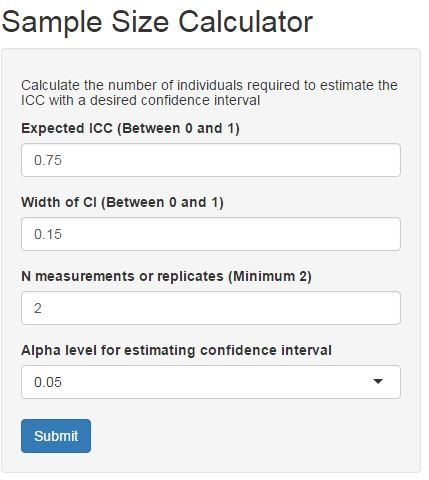

Presentation for myApp - Sample Size Calculator (Week 4 Assignment)
========================================================
author: Cynthia S. Chan
date: March 05, 2017
autosize: true
font-family: 'Helvetica'

Why Sample Sizes
========================================================

How many subjects and how many replicates per subject do you need for a reproducibility study?

When planning a reproducibility study, determination of the sample size is an important step.  Too small a sample may lead to a study that produces an imprecise estimate of measurement reliability, and too large a sample may result in a waste of resources.

A quick search on the internet results in many sample size calculators for planning a survey or a clinical study.  However, it is difficult to find such tools for a reproducibility study.


Solution
========================================================

My Shiny application is such a sample size calculator.

It walks the user through entering all information needed to calculate the number of samples needed for a reproducibility study, preventing sampling error or wasting resources. 





Development
========================================================
The app makes use of the Nest function from R package "ICC."


```r
library(ICC)
Nest("h",w=0.2,ICC=0.8,k=2,alpha=.05)
```

```
     2
0.8 51
```

However, in addition to calculating sample size based on user parameters, it also calculates the sample sizes needed for a wider CI (2x) and a narrower CI (1/2, i.e. more precision).  This allows for a quick comparison of how the desired precision required the number of samples needed and drive planning decisions.


Try It Out
========================================================

Hosted here for the next 25 days -
[Sample Size Calculator] (https://cschan.shinyapps.io/myApp/)
